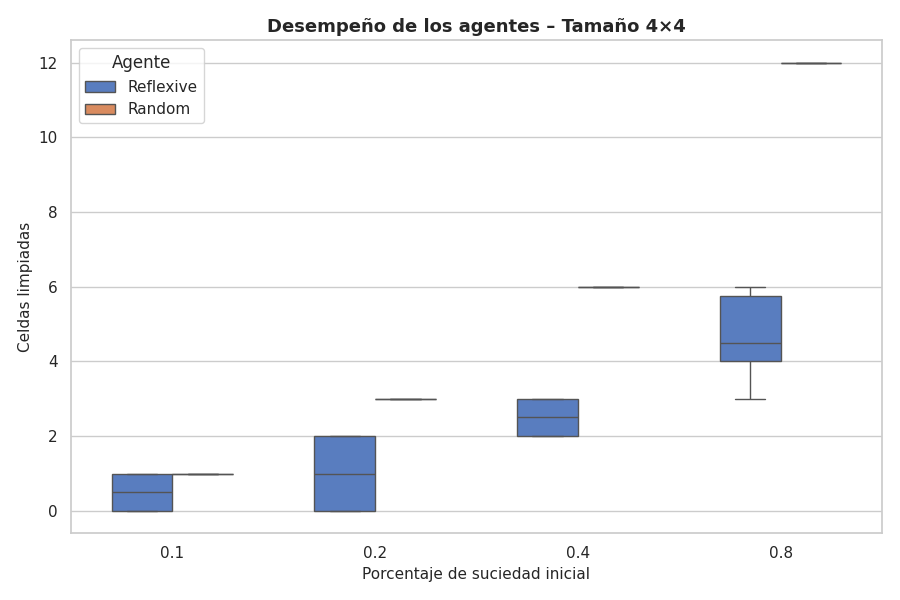

Trabajo Práctico N°2 – Agentes Racionales: Reflexivo vs Aleatorio

## 1. Introducción

El presente trabajo práctico tiene como objetivo analizar el comportamiento y el rendimiento de diferentes tipos de agentes racionales en entornos de limpieza, siguiendo el modelo de agente-ambiente propuesto en el libro *Artificial Intelligence: A Modern Approach* de Russell y Norvig.  

Se implementaron y compararon dos agentes principales:
- **RandomAgent:** selecciona sus acciones completamente al azar, pudiendo incluso ignorar la limpieza de una celda sucia.
- **ReflexiveAgent:** toma decisiones basadas en condiciones perceptuales inmediatas, limpiando cuando detecta suciedad y moviéndose de forma sistemática en caso contrario.

El análisis se realizó utilizando el entorno de simulación **Vacuum Cleaner World**, con escenarios de diferentes tamaños y niveles de suciedad inicial (dirt_rate). Los resultados fueron procesados estadísticamente y representados mediante gráficos tipo **boxplot**, permitiendo sintetizar la variabilidad de desempeño de cada agente.

## 2. Objetivos

- Comprender el concepto de racionalidad en agentes reactivos simples.  
- Implementar y ejecutar simulaciones de agentes en entornos parcialmente observables.  
- Comparar el rendimiento de agentes aleatorios y reflexivos en múltiples configuraciones.  
- Analizar la relación entre el tamaño del entorno, el nivel de suciedad y la eficiencia del agente.  
- Presentar los resultados mediante visualizaciones estadísticas (boxplots) que muestren el promedio y la dispersión de los experimentos.

## 3. Desarrollo

Las simulaciones fueron realizadas utilizando el entorno de ejecución **Vacuum Cleaner World**, provisto por la cátedra. Se configuraron entornos cuadrados de los siguientes tamaños: 2×2, 4×4, 8×8, 16×16, 32×32, 64×64 y 128×128.  
Para cada tamaño, se ejecutaron experimentos con cuatro niveles distintos de suciedad inicial (`dirt_rate`): 0.1, 0.2, 0.4 y 0.8.  
Cada combinación fue repetida 10 veces, resultando en un total de **560 ejecuciones** (7 tamaños × 4 niveles × 10 repeticiones × 2 agentes).

Los agentes se implementaron de la siguiente manera:

### 3.1 RandomAgent
El **RandomAgent** selecciona su acción siguiente de manera completamente aleatoria entre las posibles (`up`, `down`, `left`, `right`, `suck`).  
Esto implica que incluso si la celda actual está sucia, el agente puede decidir no limpiarla, reflejando un comportamiento irracional.  
Su desempeño varía significativamente entre corridas debido al azar inherente.

### 3.2 ReflexiveAgent
El **ReflexiveAgent** toma decisiones basadas en su percepción inmediata. Si la celda actual está sucia, ejecuta la acción `suck`. En caso contrario, sigue un patrón sistemático de movimiento en forma de **serpiente** (recorriendo filas alternadas).  
El agente se detiene automáticamente cuando el entorno informa que la simulación ha finalizado, evitando ciclos infinitos.

## 4. Resultados

Los resultados obtenidos fueron exportados en formato CSV y luego analizados con Python utilizando las librerías *pandas*, *matplotlib* y *seaborn*.  
Los valores de desempeño (`performance`) representan la cantidad de celdas limpias durante la simulación.

A continuación, se presentan los gráficos tipo **boxplot** generados a partir de las ejecuciones, agrupando los resultados de ambos agentes para cada tamaño de entorno.

### 4.1 Tamaño 2×2

### 4.2 Tamaño 4×4

### 4.3 Tamaño 8×8

### 4.4 Tamaño 16×16

### 4.5 Tamaño 32×32

### 4.6 Tamaño 64×64

### 4.7 Tamaño 128×128

## 5. Análisis e interpretación

Los gráficos muestran una tendencia clara a medida que aumentan el tamaño del entorno y la tasa de suciedad:

- En entornos pequeños (2×2 y 4×4), ambos agentes presentan rendimientos similares debido a la escasa complejidad del entorno.  
- A partir de tamaños medianos (8×8 y 16×16), el **ReflexiveAgent** comienza a mostrar una ventaja consistente en términos de rendimiento promedio y menor dispersión.  
- En entornos grandes (32×32, 64×64 y 128×128), el **ReflexiveAgent** supera ampliamente al **RandomAgent**, mostrando una mayor eficiencia y estabilidad en su desempeño.  

El **RandomAgent**, al tomar decisiones sin basarse en la percepción del entorno, exhibe una alta variabilidad y un rendimiento generalmente bajo, aunque mejora levemente con valores altos de `dirt_rate` por pura probabilidad de limpiar algo.

En contraste, el **ReflexiveAgent** demuestra un comportamiento racional al utilizar información perceptual local para maximizar su rendimiento, manteniendo un patrón de exploración más eficiente.

## 6. Conclusiones

- El uso de **boxplots** permitió representar de forma más clara y sintética la variabilidad de resultados en comparación con las gráficas anteriores.  
- Los resultados confirman que los agentes **reflexivos simples** pueden superar significativamente a los **aleatorios** en entornos más complejos, siempre que dispongan de percepciones inmediatas precisas.  
- La racionalidad de un agente no implica perfección, sino la capacidad de seleccionar acciones que maximicen su rendimiento esperado según el conocimiento disponible.  
- El **ReflexiveAgent** logra un equilibrio entre simplicidad y efectividad, demostrando un comportamiento racional acorde al modelo teórico estudiado.  

