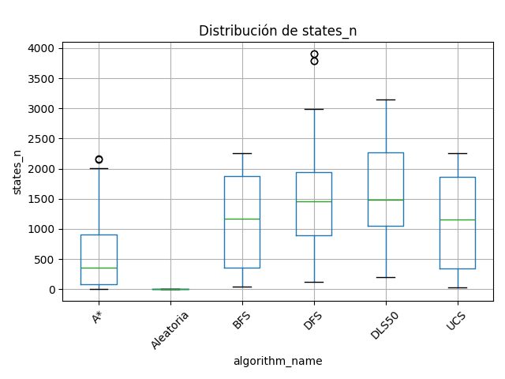
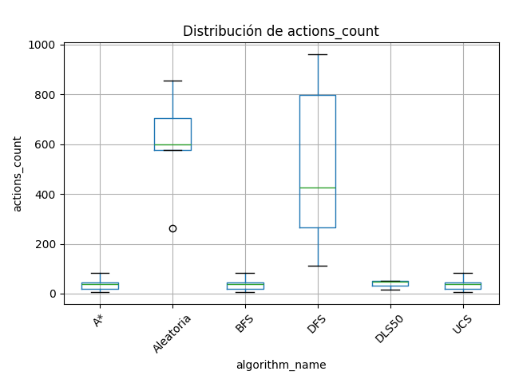
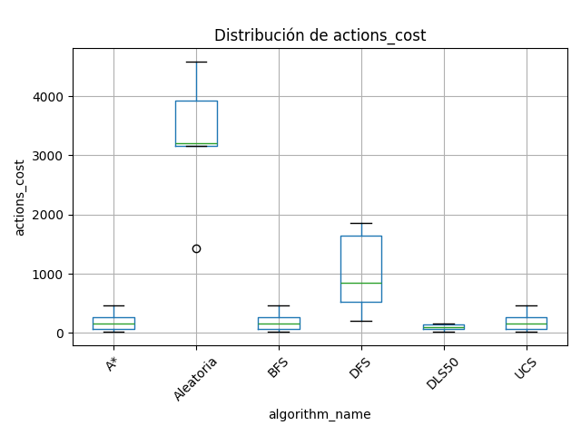
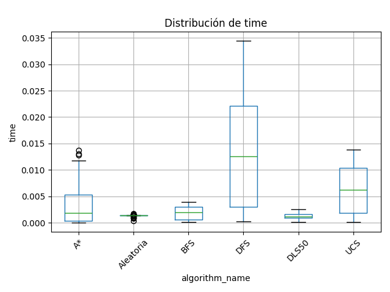

Algoritmos de Búsqueda en el entorno FrozenLake  

## 1️⃣ Descripción del experimento

Se implementaron y evaluaron **seis algoritmos de búsqueda** sobre mapas aleatorios del entorno `FrozenLake`:

- **Aleatoria**
- **Búsqueda en Anchura (BFS)**
- **Búsqueda en Profundidad (DFS)**
- **Profundidad Limitada (DLS50)**
- **Costo Uniforme (UCS)**
- **A*** (A estrella)

Cada algoritmo fue ejecutado sobre **30 mapas distintos**, en **dos escenarios**:

1. **Escenario 1:** todas las acciones tienen costo 1.  
2. **Escenario 2:** moverse arriba/abajo cuesta 10, y moverse izquierda/derecha cuesta 1.

Para cada ejecución se midieron:
- `states_n`: cantidad de estados expandidos  
- `actions_count`: cantidad total de acciones (escenario 1)  
- `actions_cost`: costo total (escenario 2)  
- `time`: tiempo de ejecución  
- `solution_found`: si se halló o no una solución

Los resultados fueron almacenados en `results.csv` y visualizados mediante gráficos tipo **boxplot**.

---

## 2️⃣ Resultados

### 2.1 Cantidad de estados explorados (`states_n`)

- **DFS** y **DLS50** presentan la mayor dispersión de valores, lo que refleja su comportamiento poco dirigido.  
- **A\*** y **UCS** expanden significativamente menos estados, al considerar heurísticas y costos.  
- **BFS** mantiene un número intermedio, mientras que **Aleatoria** no realiza exploración sistemática.

**Conclusión:**  
Los algoritmos informados (A\*, UCS, BFS) exploran menos y de forma más eficiente.

---

### 2.2 Cantidad de acciones (`actions_count`)

- **DFS** y **Aleatoria** generan caminos largos, con alta varianza.  
- **BFS**, **UCS** y **A\*** logran los caminos más cortos y consistentes.  
- **DLS50** tiene resultados acotados, pero falla con frecuencia por el límite de profundidad.

**Conclusión:**  
A\* y UCS son los más efectivos en minimizar la cantidad de pasos.

---

### 2.3 Costo total de las acciones (`actions_cost`)

- En el **escenario 2**, los costos penalizan los movimientos verticales.  
- **DFS** y **Aleatoria** muestran costos muy elevados, reflejando trayectorias ineficientes.  
- **A\***, **UCS** y **BFS** mantienen costos bajos gracias a su planificación más óptima.

**Conclusión:**  
Los algoritmos informados logran rutas horizontales más baratas.

---

### 2.4 Tiempo de ejecución (`time`)

- **DFS** es el más lento debido a su exploración profunda sin control.  
- **A\*** y **UCS** consumen más tiempo que BFS, pero compensan con soluciones óptimas.  
- **Aleatoria** y **DLS50** son rápidas, aunque poco efectivas.

**Conclusión:**  
A\* y UCS alcanzan el mejor equilibrio entre tiempo y calidad de solución.

---

## 3️⃣ Conclusiones generales

| Algoritmo | Eficiencia | Óptimo | Tiempo | Observaciones |
|------------|-------------|---------|---------|----------------|
| **Aleatoria** | Muy baja | ❌ | Bajo | Sin control, éxito aleatorio |
| **BFS** | Alta | ✅ | Medio | Encuentra soluciones óptimas, pero puede ser costoso en memoria |
| **DFS** | Baja | ❌ | Alto | Explora en profundidad sin control, caminos largos |
| **DLS50** | Media | ❌ | Bajo | Puede fallar si la solución está más profunda |
| **UCS** | Muy alta | ✅ | Medio | Óptimo en costo, más eficiente que BFS |
| **A\*** | Muy alta | ✅ | Medio-Alto | Equilibrio ideal entre costo, tiempo y exploración |

**Conclusión final:**  
> El algoritmo **A\*** presenta el mejor desempeño global, alcanzando soluciones óptimas con menor exploración que BFS y menor costo que DFS.  
> **UCS** logra resultados similares en entornos sin heurística.  
> En contraposición, **DFS** y **Aleatoria** son los menos eficientes.

---

## 4️⃣ Archivos generados

- `results.csv` – resultados de 30×2×6 ejecuciones  
- `states_n_boxplot.png` – cantidad de estados explorados  
- `actions_count_boxplot.png` – cantidad de acciones (escenario 1)  
- `actions_cost_boxplot.png` – costo total (escenario 2)  
- `time_boxplot.png` – tiempo de ejecución  

Todos los gráficos se generaron automáticamente con `matplotlib` y `pandas`.

**Entorno:** Python 3.12 + Gymnasium + Matplotlib + Pandas

