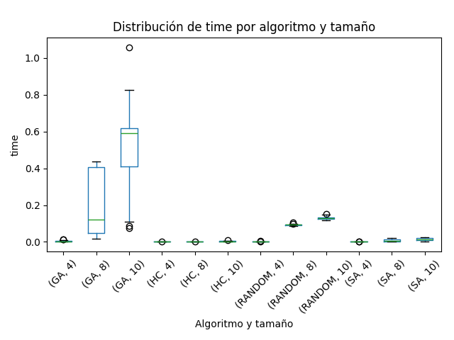

Trabajo Práctico N°4 — Búsquedas Locales

## 1. Introducción

En este trabajo práctico se implementaron y compararon distintos **algoritmos de búsqueda local y aleatoria** aplicados al problema de las **N-Reinas**. El objetivo es evaluar la capacidad de cada método para encontrar soluciones óptimas (configuraciones sin conflictos entre reinas) y analizar su desempeño en términos de calidad de solución, tiempo de ejecución y cantidad de estados explorados.

Los algoritmos implementados fueron:

* **Hill Climbing (HC)**
* **Simulated Annealing (SA)**
* **Algoritmo Genético (GA)**
* **Búsqueda Aleatoria (Random Search)**

El problema de las N-Reinas consiste en ubicar N reinas en un tablero de ajedrez de N×N de forma tal que ninguna se ataque entre sí. Para medir la calidad de una configuración se utiliza la función heurística **H(e)**, que representa el número de pares de reinas que se atacan.

## 2. Descripción de los algoritmos

### Hill Climbing

Es un algoritmo de **búsqueda local determinista** que comienza con una solución aleatoria y se mueve a un vecino con mejor valor de la función heurística. Se detiene cuando no existe ningún vecino mejor, pudiendo quedar atrapado en un óptimo local.

### Simulated Annealing

Incorpora una componente probabilística que le permite **aceptar temporalmente peores soluciones** según una función de temperatura que disminuye progresivamente. Este mecanismo simula el enfriamiento de los metales, favoreciendo la exploración al inicio y la explotación al final.

### Algoritmo Genético

Se basa en la **evolución natural**. Trabaja con una población de soluciones que se combinan (cruzamiento) y modifican (mutación) para generar nuevas generaciones. Las mejores soluciones son seleccionadas según su aptitud (menor H). Este enfoque es estocástico y explora múltiples zonas del espacio de búsqueda.

### Búsqueda Aleatoria

Genera soluciones completamente al azar y conserva la mejor encontrada. No utiliza información heurística ni dirección de mejora, por lo que sirve como referencia base para comparar el rendimiento de los algoritmos guiados.

---

## 3. Metodología experimental

Para todos los algoritmos se trabajó con los siguientes parámetros:

* **Tamaños del tablero:** N = 4, 8 y 10.
* **Semillas aleatorias:** 30 ejecuciones por combinación.
* **Límite de estados:** 10.000.

El archivo de resultados consolidado fue **`tp4-Nreinas.csv`**, y el análisis se realizó mediante el script **`analysis.py`**, que generó los gráficos comparativos y un resumen estadístico de las ejecuciones.

---

## 4. Resultados y análisis

### 4.1 Distribución de H por algoritmo y tamaño

El gráfico muestra la distribución de los valores heurísticos obtenidos. Se observa que:

* **Simulated Annealing (SA)** logra valores de H cercanos a cero en la mayoría de los casos.
* **Hill Climbing (HC)** presenta mayor dispersión, indicando que suele quedar atrapado en óptimos locales.
* **Genetic Algorithm (GA)** obtiene buenos resultados, especialmente para N=8 y N=10.
* **Random Search** presenta un rendimiento más variable, aunque en algunos casos encuentra soluciones aceptables por azar.

### 4.2 Distribución de tiempo de ejecución

El tiempo de ejecución muestra que:

* **Hill Climbing** y **Simulated Annealing** son los más eficientes en tiempo.
* **Genetic Algorithm** requiere más tiempo debido al manejo de poblaciones y operadores genéticos.
* **Random Search** mantiene tiempos bajos, aunque con gran variabilidad.

### 4.3 Distribución de estados explorados

En términos de cantidad de estados:

* **Hill Climbing** suele explorar pocos estados antes de converger.
* **Simulated Annealing** y **Genetic Algorithm** recorren una mayor cantidad de configuraciones, lo que les permite evitar óptimos locales.
* **Random Search** alcanza el límite de 10.000 estados en la mayoría de ejecuciones.

---

## 5. Evolución de H()

A continuación se presentan las curvas de evolución de H para cada algoritmo:

### 5.1 Hill Climbing

Se observa una disminución rápida de H en las primeras iteraciones hasta estabilizarse en un mínimo local.

### 5.2 Simulated Annealing

La curva presenta oscilaciones típicas del algoritmo, donde se aceptan peores soluciones temporalmente. Finalmente converge a un valor óptimo o cercano a cero.

### 5.3 Genetic Algorithm

Se aprecia una mejora abrupta en las primeras generaciones seguida de una estabilización, reflejando el proceso evolutivo del algoritmo.

### 5.4 Random Search

La evolución de la mejor solución mejora en los primeros pasos y luego se mantiene constante, ya que el algoritmo no utiliza información heurística.

#### Variante completa de evolución aleatoria

En este gráfico se distinguen dos curvas:

* La **gris**, correspondiente a los valores H generados aleatoriamente.
* La **azul**, que muestra el mejor H encontrado hasta el momento.
  Esto permite visualizar que, aunque el algoritmo genera soluciones sin dirección, eventualmente encuentra mejores configuraciones por azar.

## 6. Conclusiones

Hill Climbing es rápido y simple, pero sensible a los óptimos locales.

Simulated Annealing logra un equilibrio entre exploración y explotación, ofreciendo resultados consistentes y de buena calidad.

Genetic Algorithm presenta un rendimiento robusto, con mejores H promedio, aunque a costa de mayor tiempo de ejecución.

Random Search confirma la importancia de la heurística: sin dirección guiada, la mejora ocurre sólo por casualidad.

### 6.1 Respuesta al Ejercicio 7 — Algoritmo más adecuado

Considerando los tres algoritmos no aleatorios implementados (HC, SA y GA), el más adecuado para el problema de las N‑Reinas es Simulated Annealing (SA).

Justificación basada en los resultados obtenidos:

Robustez (tasa de éxito): SA alcanzó la mayor tasa de soluciones con H = 0 para N = 8 y N = 10, mientras que GA fue intermedio y HC tendió a atascarse (especialmente en N = 10). Véase images/boxplot_H.png.

Calidad de solución: Las distribuciones de H con SA están más concentradas en valores bajos, evidenciando menor cantidad de conflictos residuales.

Costo computacional: SA mantuvo tiempos de ejecución bajos y menos estados que GA (que trabaja con poblaciones y suele llegar al límite de estados), ofreciendo un mejor compromiso calidad/tiempo. Véase images/boxplot_time.png y images/boxplot_states.png.

Dinámica del algoritmo: La curva images/h_evolution_SimulatedAnnealing.png muestra oscilaciones controladas (aceptación de peores estados al inicio) que permiten escapar de óptimos locales; HC se estabiliza rápido (óptimo local) y GA se aplanó tras mejora inicial.

Síntesis: SA ofrece el mejor compromiso entre tasa de éxito, calidad de solución, tiempo y simplicidad de implementación. GA puede igualarlo o superarlo en algunos casos, pero con mayor coste computacional; HC es el más rápido, aunque el menos robusto en N grandes.
