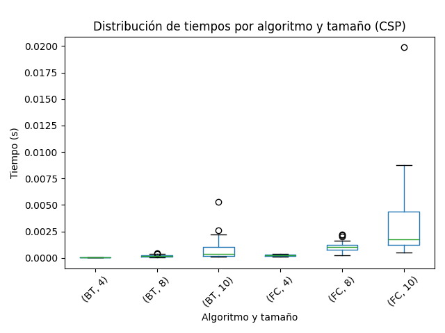
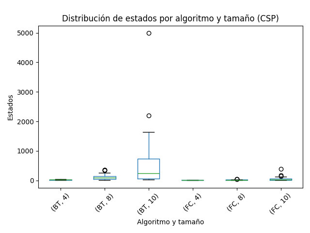

Trabajo Práctico N°5 — Satisfacción de Restricciones (CSP)

## 1. Formulación CSP del Sudoku

Un Sudoku de 9×9 se modela como un **problema de satisfacción de restricciones (CSP)**:

- **Variables:** 81 variables X{i,j} (una por celda, con i,j∈{1,…,9}).

- **Dominios:** D{i,j} = {1,...,9}. Si una celda está preasignada, su dominio se fija a dicho valor.
- **Restricciones:**
  1. **Filas**: los 9 valores de cada fila deben ser todos distintos (**AllDifferent**).
  2. **Columnas**: los 9 valores de cada columna deben ser todos distintos (**AllDifferent**).
  3. **Bloques 3×3**: los 9 valores de cada subcuadro 3×3 deben ser todos distintos (**AllDifferent**).

Estas restricciones pueden expresarse como **binarias** (\(X_{a} \neq X_{b}\) cuando comparten fila/columna/bloque) o como restricciones globales **AllDifferent**. El grafo de restricciones conecta cada celda con las celdas de su misma fila, columna y bloque; cada nodo tiene 20 vecinos (≈810 aristas en total).

## 2. AC‑3 en el mapa de Australia

**Variables:** `{WA, NT, SA, Q, NSW, V, T}`.  
**Dominios:** `{rojo, verde, azul}`.  
**Restricciones:** adyacencias `WA–NT, WA–SA, NT–SA, NT–Q, SA–Q, SA–NSW, SA–V, Q–NSW, NSW–V`.

**Asignación parcial dada:** `WA = rojo`, `V = azul`.

**Ejecución resumida de AC‑3:**
1. De `WA = rojo` se elimina `rojo` del dominio de `SA` → `SA ∈ {verde, azul}`.
2. De `V = azul` se elimina `azul` del dominio de `SA` → `SA = {verde}` (forzado).
3. `SA = verde` elimina `verde` de los vecinos: `NT, Q, NSW`.
4. `WA = rojo` elimina `rojo` de `NT` → `NT = {azul}` (forzado).
5. `NT = azul` elimina `azul` de `Q` → `Q = {rojo}` (forzado).
6. `NSW` queda sin `rojo` (por `Q`), sin `azul` (por `V`) y sin `verde` (por `SA`).  
   **Resultado:** `NSW` con dominio vacío → **inconsistencia detectada**.

Conclusión: la asignación `WA = rojo, V = azul` **no puede extenderse** a una solución válida.

## 3. Complejidad de AC‑3 en un CSP con estructura de árbol

En un grafo de restricciones sin ciclos (árbol) con n variables y dominios de tamaño d, el peor caso de **AC‑3** es:

O(nd^2)

Cada arco puede revisarse un número constante de veces y cada operación `REVISE` compara a lo sumo d^2 pares.

## 4. N‑Reinas como CSP — Implementación

**Modelado**: variables Xc (fila de la reina en la **columna** c), dominios {0,...,N-1}.  
**Restricciones binarias** entre columnas i<j:
- **Filas distintas:** Xi =! Xj
- **Diagonales:** |Xi - Xj| =! |i - j|

**Algoritmos implementados** (en `code/`):
- **Backtracking (BT)** — `nqueens_csp_backtracking.py`: búsqueda en profundidad con orden de valores pseudoaleatorio por columna controlado por `seed`.
- **Forward Checking (FC)** — `nqueens_csp_fc.py`: BT + poda de dominios futuros tras cada asignación.

El orquestador de corridas está en `runner_csp.py` y el análisis/figuras en `analysis_csp.py`.

## 5. Resultados experimentales

Se ejecutó cada algoritmo **30 veces** para **N = 4, 8, 10** (semillas `0..29`).  
Los resultados crudos se guardaron en `tp5-csp-results.csv`; el script de análisis produce `tp5-csp-summary.csv` con promedios, desvíos y tasa de éxito.

### 5.1 Tablas y métricas

**Resumen:**
- **Backtracking (BT)**
  - N=4: 100% éxito; ~22 estados de media; ~5.45e‑5 s promedio.
  - N=8: 100% éxito; ~122 estados; ~2.00e‑4 s.
  - N=10: 100% éxito; ~662 estados; ~8.36e‑4 s (alta varianza por backtracking).
- **Forward Checking (FC)**
  - N=4: 100% éxito; ~7 estados; ~2.52e‑4 s.
  - N=8: 100% éxito; ~18 estados; ~1.09e‑3 s.
  - N=10: 100% éxito; ~56 estados; ~3.28e‑3 s.

### 5.2 Boxplots

**Tiempos**  

**Estados explorados**  

**Lecturas principales:** FC explora **muchos menos estados** que BT, aunque su tiempo es mayor por el costo de mantener la consistencia parcial.

### 5.3 Comparación con TP4 (búsquedas locales)

(Referencia opcional) En `tp5-vs-tp4-summary.csv` se incluye una tabla unificada con los promedios de TP4 y TP5. A alto nivel:
- CSP (BT/FC) obtuvo **100% de éxito** en todas las corridas para N=4,8,10; en TP4 el éxito dependía del algoritmo y la semilla.
- FC reduce la exploración de estados de forma **drástica** respecto a BT; ambos son **deterministas** para una semilla dada.
- Para estos tamaños, los tiempos de CSP son **muy bajos**; en N más grandes, el costo de mantener consistencia puede crecer.

## 6. Conclusiones

- El modelado CSP con **restricciones binarias** y **AllDifferent** permite resolver N‑Reinas de forma **sistemática y garantizada**.
- **Forward Checking** es preferible a **Backtracking puro** cuando interesa minimizar exploración de estados, aceptando un leve sobrecosto temporal por la poda.
- En comparación con las **búsquedas locales** del TP4, los CSP entregan garantías de solución y métricas más estables; las locales pueden ser más rápidas para ciertas instancias, pero no garantizan éxito.

