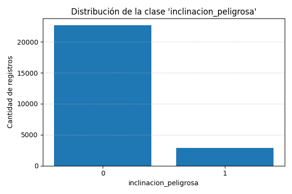
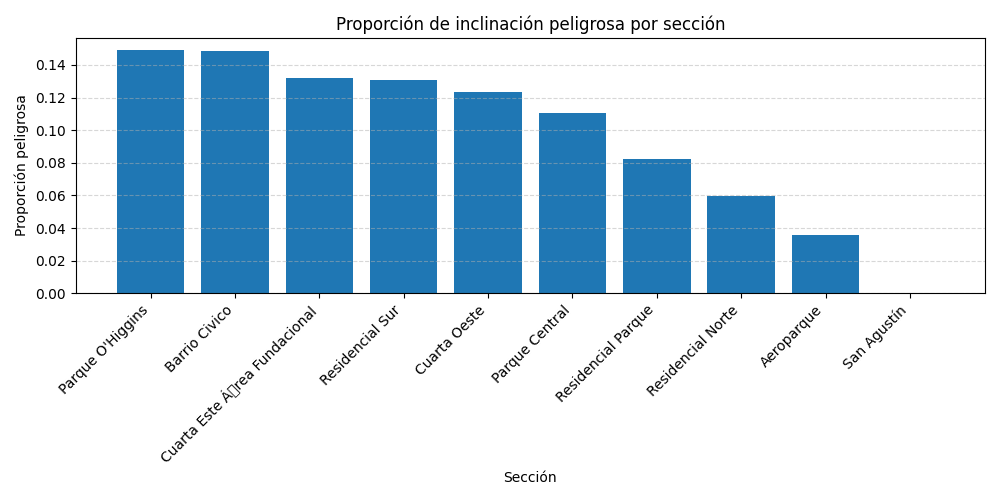
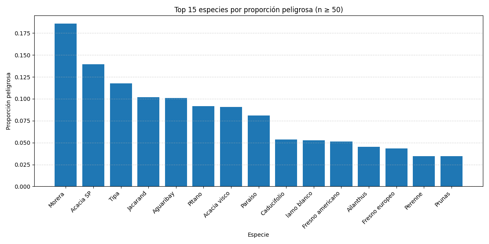
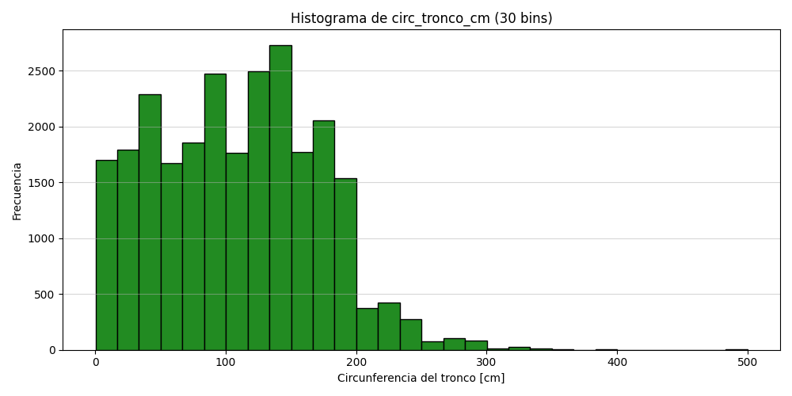
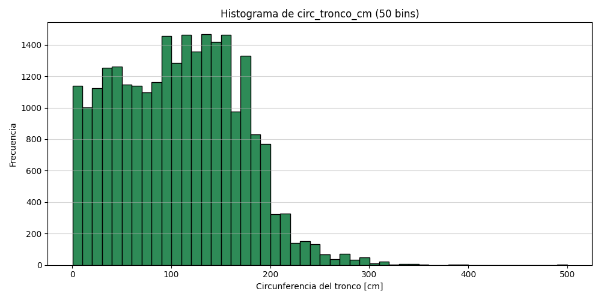
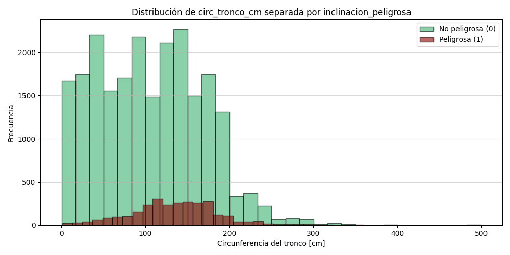

TP7B – Parte I – EDA sobre arbolado de Mendoza

## Ejercicio 2 – Análisis de inclinación peligrosa

### 2.a) Distribución de la clase `inclinacion_peligrosa`

Se trabajó sobre el archivo `arbolado-mendoza-dataset-train.csv` (80 % de los datos).

La variable objetivo `inclinacion_peligrosa` es binaria (0 = no peligrosa, 1 = peligrosa).  
La distribución observada fue:

| Clase (`inclinacion_peligrosa`) | Conteo | Porcentaje |
|---------------------------------|--------|------------|
| 0 (no peligrosa)                | 22 662 | 88,77 %    |
| 1 (peligrosa)                   |  2 868 | 11,23 %    |

Visualización utilizada:



**Conclusión:** el dataset está fuertemente desbalanceado hacia la clase **0 (no peligrosa)**: solo ~11 % de los árboles presentan inclinación peligrosa.


### 2.b) ¿Alguna sección es más peligrosa que otra?

Se calculó, para cada sección (`nombre_seccion`), la **tasa de árboles peligrosos**:

\[
\text{tasa\_peligrosa} = \frac{\text{\# árboles con inclinacion\_peligrosa = 1}}{\text{\# árboles totales en la sección}}
\]

y se ordenó de mayor a menor. El gráfico utilizado (barras por sección) fue:



Las secciones con mayor tasa de peligrosidad fueron (top 5):

| Sección                         | Árboles (n) | Tasa peligrosa |
|---------------------------------|-------------|----------------|
| Parque O'Higgins                | 2 266       | 0,1492         |
| Barrio Civico                   | 3 012       | 0,1484         |
| Cuarta Este Área Fundacional    | 3 176       | 0,1322         |
| Residencial Sur                 | 4 138       | 0,1310         |
| Cuarta Oeste                    | 3 452       | 0,1231         |

**Conclusión:** sí, se pueden identificar secciones claramente más peligrosas que otras. En particular, **Parque O’Higgins** y **Barrio Cívico** presentan las mayores proporciones de árboles con inclinación peligrosa.

### 2.c) ¿Alguna especie es más peligrosa que otra?

De manera análoga, se calculó para cada especie (`especie`) la **tasa de inclinación peligrosa**.  
Para evitar ruido de especies con muy pocos ejemplares, se consideraron solo aquellas con **n ≥ 50** y se listó el **top 15** por tasa.

Visualización utilizada:



Resumen de las especies con mayor proporción de árboles peligrosos (n ≥ 50):

| Especie           | Árboles (n) | Tasa peligrosa |
|-------------------|-------------|----------------|
| Morera            | 10 576      | 0,1859         |
| Acacia SP         |   574       | 0,1394         |
| Tipa              |    68       | 0,1176         |
| Jacarand          |   285       | 0,1018         |
| Aguaribay         |   228       | 0,1009         |
| Pltano            |  2 395      | 0,0914         |
| Acacia visco      |    55       | 0,0909         |
| Paraiso           |  2 279      | 0,0812         |
| Caducifolio       |   355       | 0,0535         |
| lamo blanco       |   114       | 0,0526         |
| Fresno americano  |  1 127      | 0,0515         |
| Ailanthus         |   176       | 0,0455         |
| Fresno europeo    |  4 473      | 0,0436         |
| Perenne           |   259       | 0,0347         |
| Prunas            |   320       | 0,0344         |

**Conclusión:** sí, hay especies que pueden considerarse **más peligrosas**.  
En particular, **Morera** destaca tanto por su gran cantidad de ejemplares como por su tasa de inclinación peligrosa (~18,6 %), seguida por **Acacia SP**, **Tipa**, **Jacarand** y **Aguaribay**.

## Ejercicio 3 – Análisis de `circ_tronco_cm`

### 3.a) Histograma de frecuencia de `circ_tronco_cm`

Se generaron histogramas de la variable `circ_tronco_cm` (circunferencia del tronco en cm) con distintos números de bins (10, 30 y 50):

- `histograma_circ_tronco_cm_10bins.png`
- `histograma_circ_tronco_cm_30bins.png`
- `histograma_circ_tronco_cm_50bins.png`





**Observaciones:**

- Distribución **asimétrica hacia la derecha**: muchos árboles con troncos finos/medios, cola larga de árboles muy gruesos.
- La mayoría de los valores se concentran aproximadamente entre **20 cm y 180 cm**.
- Hay pocos ejemplares con circunferencias muy grandes (> 200 cm).

### 3.b) Histograma separado por clase `inclinacion_peligrosa`

Se repitió el análisis separando por la clase de inclinación peligrosa:



- Curva para `inclinacion_peligrosa = 0` (no peligrosa).
- Curva para `inclinacion_peligrosa = 1` (peligrosa).

**Conclusión:**  
Las distribuciones se superponen, pero los árboles peligrosos tienden a tener **circunferencias algo mayores**, lo que sugiere que los ejemplares más desarrollados pueden tener mayor riesgo estructural.

### 3.c) Variable categórica `circ_tronco_cm_cat`

A partir de la distribución de `circ_tronco_cm` (ej. 3a), se definieron cuatro categorías:

- **bajo**
- **medio**
- **alto**
- **muy alto**

Se utilizaron los **cuartiles** de la distribución para fijar los puntos de corte:

- Puntos de corte calculados:  
  - Q1 ≈ 58 cm  
  - Q2 ≈ 110 cm  
  - Q3 ≈ 156 cm  

Se generó la variable:

```text
circ_tronco_cm_cat =
  bajo      si  0   ≤ circ_tronco_cm ≤ 58
  medio     si  58  < circ_tronco_cm ≤ 110
  alto      si  110 < circ_tronco_cm ≤ 156
  muy alto  si  156 < circ_tronco_cm ≤ circ_tronco_cm_max

